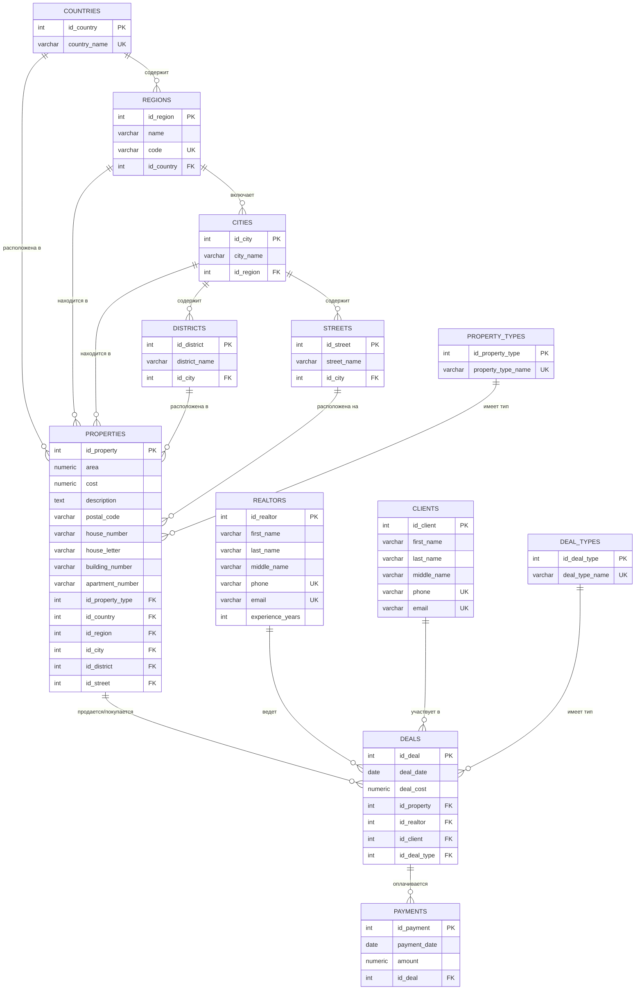

# ER-диаграмма базы данных недвижимости

## Физическая модель базы данных PostgreSQL

## Описание структуры

### Справочные таблицы
- **deal_types** - типы сделок (продажа, аренда и т.д.)
- **property_types** - типы недвижимости (квартира, дом, офис и т.д.)

### Географическая структура
- **countries** - страны
- **regions** - регионы/области
- **cities** - города
- **districts** - районы городов
- **streets** - улицы

### Основные бизнес-сущности
- **clients** - клиенты
- **realtors** - риелторы
- **properties** - объекты недвижимости
- **deals** - сделки
- **payments** - платежи по сделкам

### Ключевые особенности модели
1. Полная географическая иерархия для точного позиционирования недвижимости
2. Связь многие-ко-многим между клиентами и недвижимостью через сделки
3. Отслеживание всех платежей по каждой сделке
4. Нормализованная структура справочников 